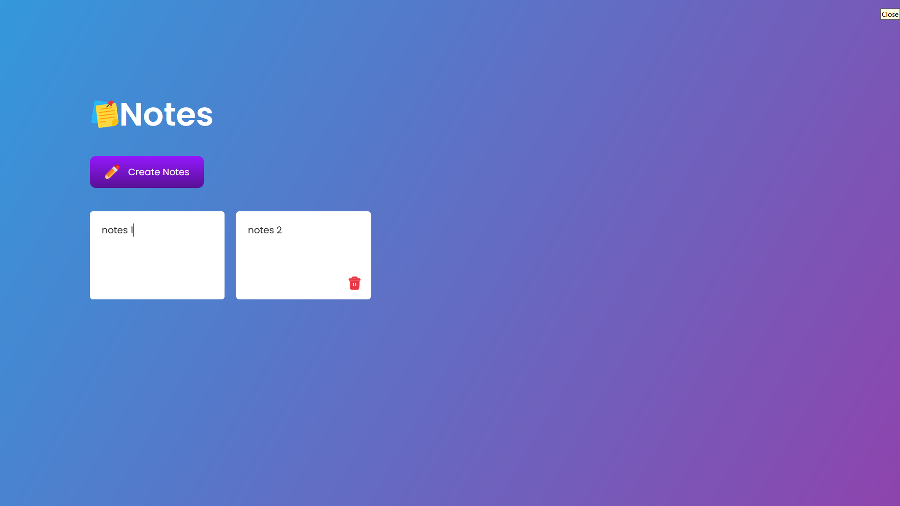

# 📓 Simple Notes App

This is a simple notes app built using **HTML**, **CSS**, and **JavaScript**. It allows users to create and manage notes easily.

## Preview

## 🚀 Getting Started

### Prerequisites

No special prerequisites are needed. Just a modern web browser to run the app.

### Installation

1. Clone the repository or download the files.
2. Open the `index.html` file in your web browser.

### Running the App

To run the app, simply open the `index.html` file in your preferred web browser. You can create notes by clicking the "Create Notes" button.

## 📝 Features

- Create notes with a simple button click.
- User-friendly interface.

## 🎨 UI Overview

The app features a clean and intuitive design with:

- A header displaying the title "Notes".
- A button to create new notes.
- A container to display existing notes.

## 🎉 Acknowledgments

Thank you for using the Simple Notes App! Happy note-taking! :partying_face:
